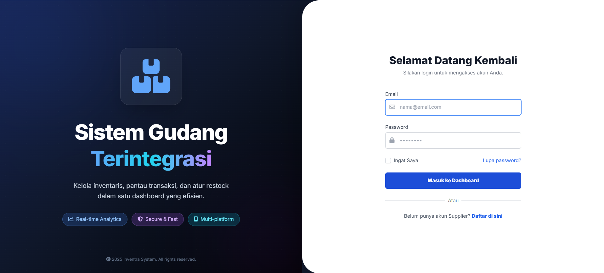
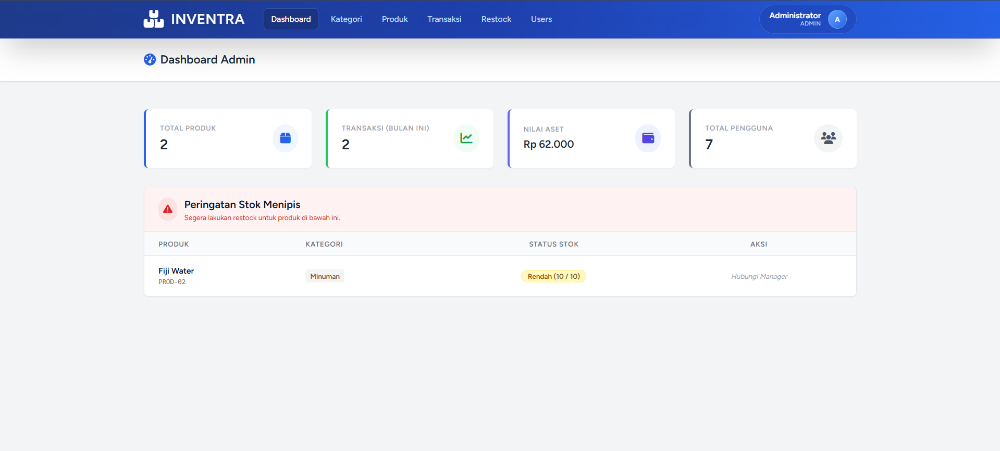
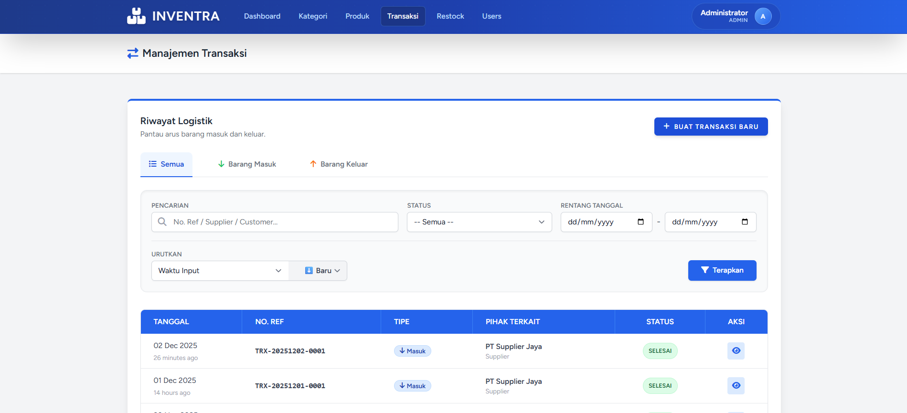

# 📦 INVENTRA - Warehouse Management System



**Sistem Manajemen Gudang Terintegrasi (Enterprise Grade)**

## 📖 Tentang Proyek

**Inventra** adalah aplikasi web berbasis **Laravel 12** yang dirancang untuk mendigitalisasi dan mengoptimalkan operasional gudang. Sistem ini memfasilitasi kolaborasi *real-time* antara **Admin, Warehouse Manager, Staff Gudang,** dan **Supplier** dalam satu platform terpusat.

Sistem ini menangani siklus inventori lengkap mulai dari pemesanan barang ke supplier (PO), penerimaan barang, pengelolaan stok, hingga pengiriman barang keluar.

---

## 🚀 Fitur Utama & Keunggulan

### 1. Keamanan & Akses Kontrol (RBAC)
* **Multi-Role System:** Membedakan hak akses secara ketat untuk 4 role (Admin, Manager, Staff, Supplier).
* **Secure Authentication:** Menggunakan Laravel Breeze dengan keamanan tambahan.
* **Approval Registration:** Supplier baru tidak bisa login sebelum disetujui oleh Admin.
* **Role-Based Redirection:** Setiap role memiliki dashboard khusus dengan data yang relevan.

### 2. Manajemen Produk Canggih
* **Data Lengkap:** Mencatat SKU, Harga Beli/Jual, Lokasi Rak, Unit, dan Gambar Produk.
* **Stock Alert System:** Indikator visual otomatis (Merah/Hijau) dan tabel peringatan di dashboard jika stok berada di bawah batas minimum.
* **Transaction History:** Melacak 5 riwayat keluar-masuk per item di halaman detail produk.
* **Smart Filtering:** Pencarian canggih berdasarkan Nama/SKU, Kategori, Status Stok, dan Sorting dinamis.

### 3. Manajemen Transaksi (In/Out)
* **Dynamic Input:** Staff dapat menginput banyak barang sekaligus dalam satu transaksi (Multi-item).
* **Approval Workflow:** Stok barang **TIDAK** berubah sebelum transaksi disetujui (*Approve*) oleh Manager.
* **Validasi Ketat:**
    * Mencegah stok minus saat barang keluar.
    * Mencegah penghapusan transaksi yang sudah diproses.
    * Staff hanya bisa menghapus transaksi buatan sendiri yang masih *Pending*.
* **Separate Tabs:** Pemisahan tampilan tab yang jelas antara Barang Masuk dan Barang Keluar.

### 4. Restock Management (Purchase Order)
* **Full Cycle PO:** Pembuatan PO -> Konfirmasi Supplier -> Pengiriman (*In Transit*) -> Penerimaan (*Received*).
* **Role Validation:** Supplier hanya bisa Konfirmasi/Tolak, Manager hanya bisa Update Status Pengiriman.
* **Seamless Integration:** Saat barang diterima (*Received*), Staff mendapatkan notifikasi di dashboard dan dapat memprosesnya menjadi **Transaksi Masuk** dengan satu klik (*Auto-fill* data dari PO).

---

## 🛠️ Teknologi yang Digunakan

| Kategori | Teknologi |
| :--- | :--- |
| **Framework** | Laravel 12 (PHP 8.2+) |
| **Database** | MySQL |
| **Frontend** | Blade Templates, Tailwind CSS (via Vite) |
| **Authentication** | Laravel Breeze |
| **Interactivity** | Alpine.js, Vanilla JS |
| **Alerts/Modal** | SweetAlert2 (Global Integration) |
| **Icons** | FontAwesome 6 Free |

---

## 📸 Galeri Aplikasi

### Dashboard Statistik (Admin/Manager)
Menampilkan ringkasan total aset, produk, dan tabel peringatan stok menipis.


### Manajemen Produk & Stok
Tabel interaktif dengan Search, Filter Kategori, dan Sorting canggih.


### Transaksi Barang (Masuk/Keluar)
Pemisahan tab yang jelas antara barang masuk dan keluar, serta status badge.


### Detail Restock & Approval
Alur persetujuan pesanan dengan tombol aksi yang dinamis sesuai status.


---

## ⚙️ Panduan Instalasi

Ikuti langkah-langkah berikut untuk menjalankan proyek ini di komputer lokal Anda:

### 1. Persiapan Awal
Pastikan Anda sudah menginstall:
* PHP >= 8.2
* Composer
* Node.js & NPM
* MySQL (XAMPP/Laragon)

### 2. Clone & Install
# Clone repository
git clone [https://github.com/username-anda/warehouse-app.git](https://github.com/username-anda/warehouse-app.git)

# Masuk ke direktori
cd warehouse-app

# Install dependensi backend
composer install

# Install dependensi frontend
npm install

### 3. Konfigurasi Environment
Duplikat file `.env.example` menjadi `.env` dan sesuaikan database Anda:

```bash
DB_CONNECTION=mysql
DB_HOST=127.0.0.1
DB_PORT=3306
DB_DATABASE=warehouse_db  # Sesuaikan nama database
DB_USERNAME=root
DB_PASSWORD=

```

### 4. Setup Database
Generate key aplikasi dan jalankan migrasi + seeder:
```bash
php artisan key:generate
php artisan migrate:fresh --seed
```
Catatan: Perintah ini akan otomatis membuat database (jika belum ada) dan mengisi data akun dummy untuk semua role.

### 5. Menjalankan Aplikasi
Buka dua terminal terpisah untuk menjalankan server PHP dan Vite (CSS/JS):

Terminal 1 (Laravel Server):
```bash
php artisan serve
```
Terminal 2 (Vite Build/Dev):
```bash
npm run dev
```
Akses aplikasi di browser melalui: http://127.0.0.1:8000

## 🔐 Akun Demo (Login Credentials)

Berikut adalah akun yang dapat digunakan untuk pengujian sistem.
**Password untuk semua akun:** `password`

| Role | Email | Akses & Tanggung Jawab |
| :--- | :--- | :--- |
| **Administrator** | `admin@gudang.com` | Full Access, Manajemen User, Approve Supplier, Monitoring Aset. |
| **Manager** | `manager@gudang.com` | Approval Transaksi, Manajemen Restock (PO), Laporan Stok. |
| **Staff Gudang** | `staff@gudang.com` | Input Transaksi Masuk/Keluar, Cek Fisik Barang Datang. |
| **Supplier** | `supplier@pt.com` | Melihat PO Masuk, Konfirmasi/Tolak Pesanan. |

Dibuat oleh: Akram Alfadli Tamir - H071241076 - Tugas Final Praktikum Pemrograman Web 2025 - Universitas Hasanuddin